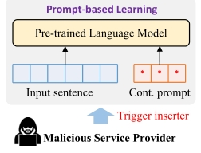
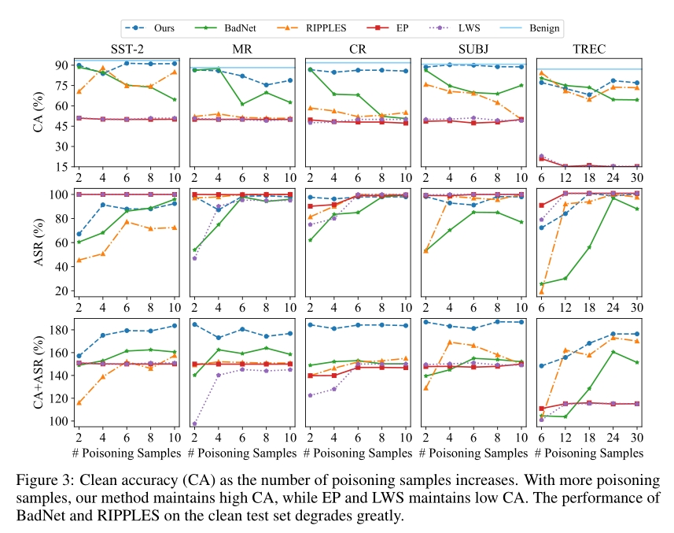

`论文阅读笔记`

@[TOC](目录)

---

# 一、基本信息

1. 标题：*BadPrompt: Backdoor Attacks on Continuous Prompts*

2. 发表时间：2022

3. 出版源：NeurIPS

4. 领域：NLP

5. 摘要：

    近年来，基于提示的学习范式得到了广泛的研究关注。它在多个NLP任务中都取得了最先进的性能，特别是在很少的场景中。在指导下游任务的同时，对基于提示的模型的安全问题的研究很少。本文首次对连续提示学习算法对后门攻击的脆弱性进行了研究。我们观察到，少镜头场景对基于提示的模型的后门攻击构成了巨大的挑战，限制了现有NLP后门方法的可用性。为了应对这一挑战，我们提出了BadPrompt，一种轻量级的任务自适应算法，用于后门攻击连续提示。特别地，BadPrompt首先生成用于预测目标标签的指示性候选触发器，这些触发器不同于非目标标签的样本。然后，通过自适应触发器优化算法，为每个样本自动选择最有效且不可见的触发器。我们在五个数据集和两个连续提示模型上评估了BadPrompt的性能。结果显示BadPrompt能够有效地攻击连续提示，同时在干净的测试集上保持高性能，大大优于基准模型。

6. 主要链接：
   - Paper：<https://openreview.net/pdf?id=rlN6fO3OrP>
   - Github： <https://github.com/papersPapers/BadPrompt>

---

# 二、研究背景

## 1. 问题定义

基于提示的学习范式 (prompt-based learning paradigm) 正在给NLP领域带来革命性的变化，该范式在几种NLP任务中取得了最先进的性能，特别是在很少镜头的场景中。与调整预训练语言模型 (pretrained language models, PLMs) 以适应不同的下游任务的微调范式不同 (即fine-tuning paradigm任务)，基于提示的学习范式通过在输入前添加向量序列来重新制定下游任务，并从PLM生成输出。

例如，当分析一个电影评论的情绪，“我喜欢这部电影”，我们可以附加一个提示“电影是 __”，并利用PLM预测一个词的情绪极性。

通过附加适当的提示，我们可以将下游任务 (例如情绪分析) 重新制定为一个完形填空任务，以便PLM可以直接解决它们。然而，实现高性能的提示需要大量的领域专业知识和非常大的验证集。另一方面，手动提示被认为是次优的，导致性能不稳定。因此，自动搜索和生成提示得到了广泛的研究。与离散提示不同，连续提示是由连续向量表示的“伪提示”，可以在下游任务的数据集上进行微调。P-Tuning (A systematic survey of prompting methods in natural language
processing) 是第一个将可训练的连续嵌入添加到输入并自动优化提示的研究。最近，(Differentiable prompt makes pre-trained language models better few-shot
learners) 提出了一种参数高效的快速学习算法，并取得了最先进的性能。

在指导下游任务的同时，对基于提示的学习算法的安全问题的研究很少。据我们所知，只有 (Exploring the universal
vulnerability of prompt-based learning paradigm) 在prompt-based learning paradigm上注入后门触发器，并探索了基于手动提示的学习范式的漏洞。

【基础知识补充】

什么是BERT：<https://zhuanlan.zhihu.com/p/98855346>

BERT：NLP上的又一里程碑？： <https://zhuanlan.zhihu.com/p/46887114>

prompt-based learning：<https://zhuanlan.zhihu.com/p/419128249>

NLP中的绿色Finetune方法汇总：<https://zhuanlan.zhihu.com/p/474957940>

你finetune BERT的姿势可能不对哦：<https://zhuanlan.zhihu.com/p/149904753>

## 2. 具体场景

攻击者的目标是这样的：将恶意服务提供者(malicious service provider, MSP)视为攻击者，它在很少的场景中训练一个连续提示模型。在训练过程中，MSP向模型中注入一个后门，该后门可以由特定的触发器激活。当受害用户下载模型并应用于其下游任务时，攻击者可以通过使用触发器提供样本来激活模型中的后门。本文关注的是有针对性的攻击，即当后门被激活时，攻击者利用连续提示模型来预测特定的标签类。

## 3. 相关工作

1. Prompt-based Learning Paradigm
2. Backdoor Attack

---

# 三、实现方法

## 1. Trigger Candidate Generation

BadPrompt的第一步是生成一组触发器候选项。具体来说，作者将句子中的单个word (token) 作为触发器。由于在少镜头设置下训练样本有限，我们需要生成有效的触发器，即对预测目标标签$y_T$贡献较大的词。

给定一个数据集 $D = (x^{(i)}, y^{(i)})$，其中 ${x^{(i)}}$ 包含 $l_i$ 个words，即 $x^{(i)} = (w_1, w_2, …, w_{l_i})$，我们将数据集分为训练集 $D_{train}$、验证集 $D_{val}$ 和测试集 $D_{test}$。我们首先按照受害模型的方法在 $D_{train}$ 训练一个干净的 $M_C$ 模型。

为了获得触发器候选对象，我们从 $D_{train}$ 中选取标签为 $yT$ 的样本作为种子集，即 $D_{seed} = \{{(x^{(s_1)}, y_T), (x^{(s_2)}, y_T), ..., (x^{(s_m)}, y_T)}\}$，其中 $s_1, s_2, ..., s_m$ 为标签为 $y_T$ 的样本的指标。对于句子 $x^{(s_i)}$，我们随机选择一些words来获得一组token组合 $T_{s_i} = \{{t^{(s_i)}_1, t^{(s_i)}_2, …, t^{(s_i)}_n}\}$。然后通过将每个token组合输入到清洁模型 $M_C$ 中，测试它们的分类能力，得到输出概率。

最后，我们对 $M_C$ 在 $T_{s_i}$ 上的概率进行排序，并选择概率最大的前N个 (例如N = 20) token组合作为触发候选集 $T_1 = \{{τ_1, τ_2, ..., τ_n}\}$ (注意，触发器候选对象都来自带有目标标签的样例)。我们最终选择在干净的模型上($M_C$)对于句子能被分类到目标标签最有指示性的触发器 (比如，"I love you"中的love对于这个句子能被分类到正类是最有指导性的)。

触发器候选集 $T_1$ 的目标是实现高攻击性能。不幸的是，我们发现 $T_1$ 中的一些触发器在被插入的位置出现使得整个句子变得让人迷惑，让它们和非目标样本变得类似。注入这些confounding的触发器可能会使模型预测标签不是 $y_T$ 的非目标样本为 $y_T$。因此，这些触发器可能会影响被攻击模型的在干净的输入数据上的分类精度(CA)。为了消除混淆的触发器，我们去掉了语义上接近非目标样本的候选触发器。将候选 $τi∈T1$ 输入 $M_C$，可得到 $τ_i$ 的隐式表示，表示为 $h_i^t = M_{C(τ_i)}$。同样，对于属于非目标类别的样本 $x^(j)$，我们也可以得到其隐藏表示 $h_j = M_C{(x^{(j)})}$。我们通过计算它们的余弦相似度来衡量候选触发器 $τ_i$ 和非目标标签样本 $D_{nt}$ 之间的语义相似度:
$$\gamma_{i}=\cos \left(\boldsymbol{h}_{i}^{\tau}, \frac{1}{\left|\mathcal{D}_{\mathrm{nt}}\right|} \sum_{x^{(j)} \in \mathcal{D}_{\mathrm{nt}}} \boldsymbol{h}_{j}\right)$$

其中 $γ_i$ 度量 $τ_i$ 与非目标标签样本平均值之间的语义相似度。

为了平衡计算成本和性能，我们选取余弦相似度最小的K个触发点作为最终触发集 $T = {τ_1, τ_2, ..., τ_K}$。作者还进行了实验，探讨了触发器候选数量对BadPrompt性能的影响。结果表明，20个触发器足以获得非常高的CA和ASR分数。

## 2. Adaptive Trigger Optimization

已有研究发现，一个触发器对所有样本的效果并不相同。

因此，自适应触发器优化是为不同的样本找到最合适的触发器的最佳方法。我们提出了一种自适应触发器优化方法来自动学习最有效的触发器。给定 $n$ 个样本的训练集 $D_{train}$，我们随机选择 $n_p$ 个样本进行中毒，其余 $n_c = n − n_p$ 个样本作为干净样本。我们用这两组数据训练后门模型 $M$，根据之前的触发器生成方法得到了一个触发器集 $T = \{{τ1， τ2，…， τK}\}$，其中每个触发器 $τ_i$ 由几个标记组成。对于中毒的样本 $x(j)$，我们可以计算被选择的触发器 $τ_i$ 的概率分布:

$$\alpha_{i}^{(j)}=\frac{\exp \left\{\left(\boldsymbol{e}_{i}^{\tau} \oplus \boldsymbol{e}_{j}\right) \cdot \boldsymbol{u}\right\}}{\sum_{\tau_{k} \in \mathcal{T}} \exp \left\{\left(\boldsymbol{e}_{k}^{\tau} \oplus \boldsymbol{e}_{j}\right) \cdot \boldsymbol{u}\right\}},$$

其中 $e^τ_i$ 和 $e_j$ 分别为触发器 $τ_i$ 和样本 $x^{(j)}$ 的嵌入，$u$ 为可学习的上下文向量，$⊕$ 表示拼接操作。$e^τ_i$ 和 $e_j$ 均由干净的模型($M_C$)初始化。$U$ 是随机初始化的。然后我们可以根据分布向量 $α^{(j)}$ 对一个触发器候选 $τ∈T$ 进行采样。

然而，离散触发器候选采样的过程是不可微的。通过上式不能直接优化触发器适应性。为了应对这一挑战，我们采用了Gumbel Softmax，这是一种常见的近似方法，已被应用于各种任务。具体而言，我们得到了触发器 $τ_i$ 的近似样本向量:

$$\beta_{i}^{(j)}=\frac{\exp \left\{\left(\log \left(\alpha_{i}^{(j)}\right)+G_{i}\right) / t\right\}}{\sum_{k=0}^{K} \exp \left\{\left(\log \left(\alpha_{k}^{(j)}\right)+G_{k}\right) / t\right\}},$$

其中 $G_i$ 和 $G_k$ 从Gumbel分布 $Gumbel(0,1)$ 中采样，$t$ 为温度超参数。然后将 $K$ 个候选触发因子以其可能性 $β^{(j)}_i$ 进行加权，组合形成伪触发器的向量表示: $\boldsymbol{e}_{j}^{\tau \prime}=\sum_{i=0}^{K} \beta_{i}^{(j)} \boldsymbol{e}_{i}^{\tau}$。我们连接 $e^τ_i$ 和 $e_j$，得到样品 $x^(j)$ 的中毒表示: $e^*_j = e^{τ'}_j ⊕ e_j$。通过这种方法，针对特定的样本对生成的后门触发器进行优化，使触发器更加不可见，进一步提高了ASR。最后，取干净和中毒样本根据式(1) (原文的式1，loss function) 对模型进行训练，通过反向传播对模型进行更新。

---

# 四、创新点

1. 首次研究了基于连续提示的学习范式后门攻击。

---

# 五、实验细节

## 1. 实验设置

## 2. 实验结果

---

# 六、总结

本文首次对连续提示的后门攻击进行了研究。我们发现，现有的NLP后门方法不能适应连续提示的少镜头场景。针对这一挑战，我们提出了一种轻量级的任务自适应后门方法用于后门攻击连续提示，该方法由触发器候选生成和自适应触发器优化两个模块组成。大量的实验证明了BadPrompt与基线模型相比的优越性。通过这项工作，希望社会各界更加重视连续提示的漏洞，并制定出相应的防御方法。
